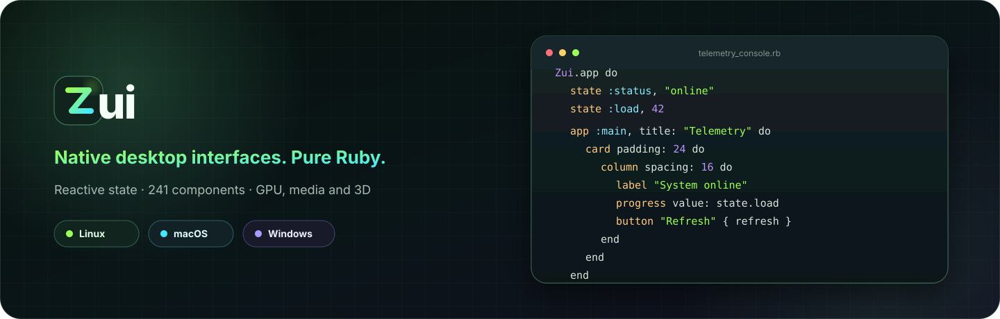
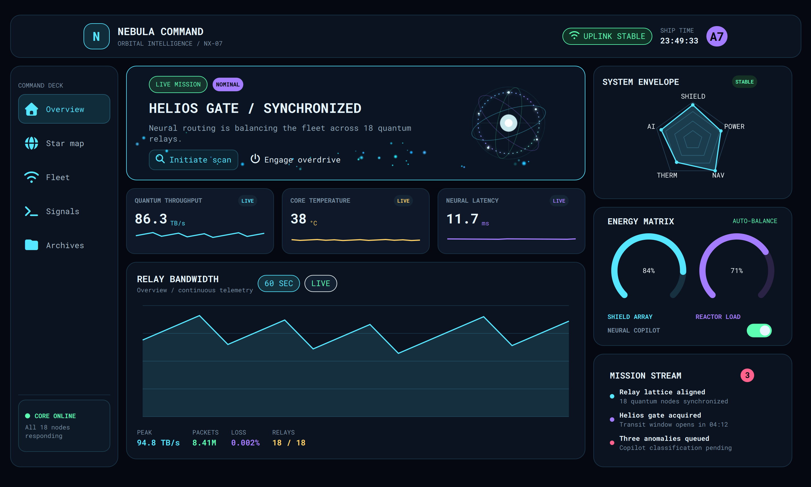

<p align="center">
  
</p>

<h1 align="center">Native applications in pure Ruby</h1>

<p align="center">
  Build reactive Linux, macOS, Windows, and iOS interfaces with one Ruby API, a native Qt renderer,
  and no application-owned QML or browser runtime.
</p>

<p align="center">
  <a href="https://rubygems.org/gems/zui"></a>
  <a href="https://github.com/AdamMusa/zui/actions/workflows/platforms.yml"></a>
  
  
  <a href="LICENSE"></a>
</p>

<p align="center">
  <a href="#quick-start">Start</a> ·
  <a href="#platform-support">Platforms</a> ·
  <a href="#component-catalog">Components</a> ·
  <a href="#reactive-by-design">Reactivity</a> ·
  <a href="#how-zui-runs">Architecture</a> ·
  <a href="#ship-an-application">Distribution</a> ·
  <a href="#showcase-applications">Examples</a> ·
  <a href="https://zui.alkimist.dev">Documentation</a>
</p>

---

Zui is a native UI framework for Ruby. Application code owns the interface, state, behavior,
and assets; Zui owns the rendering protocol, native host, platform-neutral QML implementation,
and complete component catalog. The result is a native application—not a web page inside a window.

<table>
  <tr>
    <td width="33%"><strong>One application language</strong><br>Compose UI, state, bindings, events, commands, timers, and application logic in Ruby.</td>
    <td width="33%"><strong>Native renderer</strong><br>Render through Qt Quick, Controls, Multimedia, GPU effects, Shapes, and optional 3D modules.</td>
    <td width="33%"><strong>Private verified runtime</strong><br>Install a checksummed native client without changing system Qt or shell configuration.</td>
  </tr>
  <tr>
    <td><strong>241 named components</strong><br>Use specific controls with validated properties and events instead of a generic markup escape hatch.</td>
    <td><strong>Reactive by default</strong><br>Update only changed properties and publish multi-value transactions as atomic patch batches.</td>
    <td><strong>Portable source</strong><br>Run the same application on Linux, macOS, Windows, iOS, or through an environment adapter such as Omarchy UI.</td>
  </tr>
</table>

## Beautiful user experiences

Build polished, responsive interfaces in Ruby—from focused utilities to immersive,
data-rich dashboards.

<p align="center">
  
</p>

<p align="center"><sub>Nebula Command demonstrates Zui charts, gauges, particles, navigation, controls, and reactive telemetry.</sub></p>

## Quick start

Install Ruby 3.1 or newer and the gem. Zui downloads its version-matched native client and small
mruby bundle runtime only when you explicitly configure it:

```bash
gem install zui
zui doctor --fix
zui new telemetry-console
cd telemetry-console
zui run main.rb
```

That is the complete development setup. You do not need a Qt SDK, CMake, a C++ compiler, or a
system-wide Qt installation.

`zui doctor --fix` downloads the native client and lite mruby runtime for the installed Zui
version, verifies their SHA-256 checksums and manifests, and activates them atomically in the user
cache. It does not modify shell startup files or global Qt environment variables.

### Run on iPhone

Mobile builds use the same Ruby source and native renderer, with mruby embedded directly in the
iOS application. On a Mac with Xcode, a Qt 6.8 iOS SDK and matching host Qt SDK, mruby, and
mruby-json, run:

```bash
zui mobile ios path/to/application \
  --qt-ios ~/Qt/6.8.3/ios \
  --qt-host ~/Qt/6.8.3/macos \
  --mruby ~/src/mruby \
  --mruby-json ~/src/mruby-json
```

Zui precompiles the app to mruby bytecode, creates an optimized native `.app`, selects a compatible
simulator, installs it, and launches it. The VM and Qt renderer run in the same process; no Ruby
child process is started. The
paths can instead be set once through `ZUI_QT_IOS`, `ZUI_QT_HOST`, `ZUI_MRUBY_ROOT`, and
`ZUI_MRUBY_JSON`. Use `--simulator ID` to select a device or `--build-only` to stop after building.
The app name, bundle identifier, version, and 1024×1024 PNG icon come from `config.rb`.

To sign, install, and launch on a paired physical iPhone with Developer Mode enabled, pass its
Xcode device UDID and your Apple development team:

```bash
zui mobile ios path/to/application --device DEVICE_UDID --team APPLE_TEAM_ID \
  --qt-ios ~/Qt/6.8.3/ios --qt-host ~/Qt/6.8.3/macos \
  --mruby ~/src/mruby --mruby-json ~/src/mruby-json
```

`ZUI_APPLE_TEAM` can be used instead of `--team`.

## Your first application

```ruby
require "zui"

module Counter
  def self.run
    Zui.app do
      state :count, 0

      app :main, title: "Counter", width: 640, height: 420 do
        container padding: 24 do
          column spacing: 16 do
            label "Counter"
            text { "Count: #{state.count}" }
            button "Increment" do
              state.count += 1
            end
          end
        end
      end
    end
  end
end

Counter.run
```

The source is ordinary Ruby. Zui validates the declared tree, sends it through a versioned JSON
protocol, and renders it with native Qt components. Application QML is neither required nor
accepted through the runtime protocol.

## Reactive by design

State, bindings, animation, scheduled work, and events live in the same builder context:

```ruby
Zui.app do
  state :status, "online"
  state :uptime, 0

  app :main, title: "Service Monitor", width: 720, height: 480 do
    card padding: 24 do
      column spacing: 12 do
        indicator = badge state.status
        bind(indicator, :value) { state.status.upcase }
        bind(indicator, :foreground) { state.status == "online" ? "#9cff57" : "#ff6f7d" }

        text { "Uptime: #{state.uptime}s" }

        button "Reconnect" do
          transaction do
            state.status = "online"
            state.uptime = 0
          end
        end
      end
    end
  end

  every(1) { state.uptime += 1 }
end
```

- `state` defines application-owned values.
- Value components can take a block for their primary reactive property.
- `bind` connects any declared property to application state.
- `transaction` publishes related changes together.
- `after`, `every`, and `async` schedule application work.
- `animate` and animation components use native render-side transitions.
- `dynamic` rebuilds data-dependent child structures without rebuilding the whole application.

Reusable UI modules are scoped to one application builder, so domain components do not leak into
other applications:

```ruby
module TelemetryConsole
  module UI
    def dashboard
      card { text "System online" }
    end
  end

  def self.build
    Zui::Application.new(ui: UI) do
      app(:main, title: "Telemetry Console") { dashboard }
    end
  end
end
```

## Platform support

Zui uses the same Ruby API, protocol, renderer, catalog, and application source on every supported
target. Desktop releases use a versioned client; iOS embeds the renderer and mruby inside the app.

| Operating system | Architecture | Runtime shape | Build output | Release status |
| --- | --- | --- | --- | --- |
| Linux | x86-64 | `zui-client-linux-x86_64` | Portable application directory | Supported and CI verified |
| macOS | Apple Silicon | `zui-client-macos-arm64` | Standard `.app` bundle | Supported and CI verified |
| macOS | Intel x86-64 | `zui-client-macos-x86_64` | Standard `.app` bundle | Supported and CI verified |
| Windows | x86-64 | `zui-client-windows-x86_64` | Portable application directory | Supported and CI verified |
| iOS Simulator | x86-64 | Embedded native host + mruby | Standard simulator `.app` | Mobile preview, install and launch verified |

Desktop application bundles do not require Ruby on the destination. The default `--lite` mode embeds Zui's
versioned mruby runtime. `--full` embeds a private CRuby plus only the non-Zui gems resolved by the
project's `Gemfile.lock`.

Unsupported architectures fail explicitly during configuration. Zui never silently compiles Qt,
uses a system Qt installation, or downloads an asset for a different platform. See the complete
[platform and bundle layouts](docs/platforms.md).

## Component catalog

Zui 0.0.10 registers **241 built-in components**. Every entry has a named Ruby builder method,
property and event schema, native QML renderer, reactive patch support, and contract tests.

| Category | Count | Representative components |
| --- | ---: | --- |
| Foundation and layout | 28 | `container`, `grid_layout`, `scroll`, `split_view`, `application_window` |
| Display, content, and media | 24 | `text`, `image`, `markdown`, `video`, `model_view_3d` |
| Buttons and input | 36 | `button`, `text_field`, `slider`, `date_picker`, `multi_select` |
| Navigation and structure | 20 | `tabs`, `drawer`, `stack_view`, `breadcrumb`, `key_catcher` |
| Menus, dialogs, and feedback | 19 | `dialog`, `popup`, `toast`, `progress_ring`, `bottom_sheet` |
| Data and collections | 22 | `list_view`, `grid_view`, `table_view`, `tree_view`, `calendar` |
| Charts and visualization | 16 | `line_chart`, `candlestick_chart`, `heatmap`, `gauge`, `legend` |
| Drawing and interaction | 16 | `canvas`, `shape`, `shader_effect`, `drag_area`, `particle_system` |
| Animation, state, and timing | 32 | `animation`, `transition`, `timer`, `state_group`, `spring_animation` |
| Effects | 7 | `multi_effect`, `blur`, `drop_shadow`, `colorize`, `glow` |
| Multimedia and capture | 12 | `media_player`, `camera`, `audio_input`, `video_output`, `screen_capture` |
| Models and utilities | 9 | `list_model`, `settings`, `clipboard`, `standard_paths` |

Zui does not silently replace unavailable components with screenshots, generic controls, or
application-specific fallbacks. A declared component either renders as that component or reports
an explicit error.

- Browse the [complete source-backed component reference](https://zui.alkimist.dev/components).
- Review the [component coverage matrix](docs/component-coverage.md).

## Command-line workflow

| Command | Purpose |
| --- | --- |
| `zui --help` | List every command and global option |
| `zui help COMMAND` | Show detailed usage, options, and examples for one command |
| `zui new NAME` | Generate a pure-Ruby application, `Gemfile`, distribution config, and reusable UI module |
| `zui doctor` | Report Ruby, platform, native-client, run, and bundle readiness without changing anything |
| `zui doctor --fix` | Download, verify, and install the missing native client and lite mruby runtime |
| `zui configure` | Perform the same explicit runtime installation directly |
| `zui run FILE` | Launch a Ruby entry point through the private native client |
| `zui bundle [DIRECTORY]` | Build the default standalone `--lite` bundle with embedded mruby |
| `zui bundle --full [DIRECTORY]` | Embed private CRuby and only the gems locked by the project |
| `zui bundle --name NAME --output PATH` | Override the generated product name and destination |
| `zui bundle --no-tree-shake` | Retain the complete component and Qt feature catalog for metaprogrammed applications |
| `zui bundle --dist [DIRECTORY]` | Build release installers from the required project-root `config.rb` |
| `zui version` | Print the installed framework version |

Every command also supports `-h` and `--help` directly, such as `zui bundle --help`.
Usage errors point to the relevant command help without starting downloads, builds, or applications.

Zui has no separate validation command. Ruby, DSL, schema, resource, protocol, and renderer errors
are reported by the operation that encounters them.

## How Zui runs

```text
┌─────────────────────────────────────────────────────────────────────┐
│ Ruby application                                                   │
│ UI modules · state · bindings · events · commands · assets         │
└──────────────────────────────┬──────────────────────────────────────┘
                               │ versioned JSON protocol
┌──────────────────────────────▼──────────────────────────────────────┐
│ Zui native client                                                  │
│ process transport · schema validation · lifecycle · error boundary │
└──────────────────────────────┬──────────────────────────────────────┘
                               │ declared component tree + patches
┌──────────────────────────────▼──────────────────────────────────────┐
│ Platform-neutral renderer                                          │
│ ControlNode · theme · controls · 241-component QML catalog         │
└──────────────────────────────┬──────────────────────────────────────┘
                               │
              Qt Quick · Controls · Multimedia · GPU · 3D
```

Ruby owns application logic. The native client owns the Qt event loop and graphics runtime. On
desktop, the versioned protocol crosses a private process boundary. On iOS, the same protocol is
carried by an in-process mruby bridge. The renderer applies the same validated trees and bounded
reactive patch batches in both forms.

The client intentionally excludes browser-engine payloads. Zui does not use
HTML, CSS, JavaScript, WebView, Electron, or Qt WebEngine to render application interfaces.

## Native client integrity

The RubyGem contains the Ruby framework, QML catalog, and mobile host source, but not a prebuilt
desktop platform client. Native desktop clients are built by the release matrix and attached to the
matching GitHub tag.

During setup, Zui verifies:

1. The release asset name matches the detected platform and architecture.
2. The downloaded archive matches its published SHA-256 checksum.
3. Every archive path is safe before extraction.
4. `client.json` has the expected format, Zui version, platform, executable, and bundle capability.
5. Activation completes atomically in the versioned user cache.

The private client includes the host executable, linked Qt libraries, QML modules, plugins, and
translations required by the catalog. `zui run` exposes those paths only to its child process.

## Ship an application

```bash
zui bundle
# or
zui bundle path/to/application --name "Telemetry Console"
```

Every distribution combines four deliberately separate payloads:

```text
application Ruby source and assets
  + Zui Ruby/QML framework runtime
  + selected private Ruby runtime (`mruby` or `cruby`)
  + configured native Qt/QML client
```

| Platform | Generated shape | Suitable next step |
| --- | --- | --- |
| Linux | Self-contained directory with `run` and desktop entry | AppImage, Flatpak, Snap, `.deb`, `.rpm`, or Arch package |
| macOS | Standard `.app` directory | Sign, notarize, and distribute with the application's release identity |
| Windows | Self-contained directory with `run.cmd` | MSIX, MSI, WiX, Inno Setup, or another installer |

No system Ruby or Qt installation is used by the finished bundle. Signing, notarization, installer
format, store submission, and application identity remain the release owner's responsibility.

`--lite` is the default. It compiles the project's local Ruby source into one mruby-compatible
program and rejects external gem `require` calls with a `--full` hint. Use `--full` for ordinary
CRuby behavior or third-party gems. Full bundles require a locked project `Gemfile`; run
`bundle install` after changing dependencies. Both modes are built for the current target OS and
architecture, and both use the same project-specific QML/native tree-shaking pass.

`zui bundle` statically analyzes every production Ruby source file, including code in conditional
branches, and retains only the referenced Zui adapters, QML modules, plugins, and native library
dependency closure. Test, spec, vendor, temporary, and previous distribution directories do not
affect the result. The selected components and byte savings are recorded in `zui-bundle.json`.

Ruby can compute method names at runtime, so applications that invoke components through
metaprogramming must declare those possible types in `.zui-bundle.json`:

```json
{
  "components": ["camera", "video_output"]
}
```

Use `--no-tree-shake` only when the possible component set cannot be declared.

### Native installers

`zui bundle --dist` creates the same tree-shaken application bundle and then packages it for the
current operating system:

| Host platform | Distribution artifacts |
|---|---|
| Linux | `.deb` and `.rpm` |
| macOS | `.dmg` containing the `.app` and an Applications shortcut |
| Windows | Inno Setup `.exe` installer |

Release packaging requires a `config.rb` file in the project root. It is executable Ruby using a
validated Zui DSL:

```ruby
Zui::Dist.configure do
  name "Telemetry Console"
  identifier "com.example.telemetry-console"
  version "1.0.0"
  publisher "Example Company <dev@example.com>"
  description "A native telemetry dashboard."
  license "MIT"
  homepage "https://example.com/telemetry-console"

  icon linux: "assets/icon.png",
       macos: "assets/icon.icns",
       windows: "assets/icon.ico",
       ios: "assets/icon.png"
  categories "Utility", "Development"
end
```

Only the current platform's icon is required when packaging: PNG or SVG on Linux, ICNS on macOS,
ICO on Windows, and a 1024×1024 PNG on iOS. Paths must remain inside the project. `--output DIRECTORY` selects the artifact
directory, and existing artifacts are never overwritten. Linux RPM creation requires `rpmbuild`
(`rpm-build` or `rpm-tools`), macOS uses the system `hdiutil`, and Windows requires Inno Setup 6's
`ISCC.exe` on `PATH`.

The installers carry the application, selected Ruby runtime, Zui, Qt, and selected native
dependencies. They do not declare or require system Ruby. Code signing, Apple notarization, and
Windows Authenticode signing remain release-owner steps.

## Showcase applications

The repository includes complete Ruby applications rather than isolated visual snippets:

| Application | What it demonstrates |
| --- | --- |
| [Avatar Runner](examples/avatar_runner/) | Keyboard focus, pointer input, timed physics, Canvas drawing, and atomic state patches |
| [Nova Pour](examples/nova_pour/) | Image loading, filtering, cart state, dialogs, bindings, and order simulation |
| [Tesla Drive Dashboard](examples/tesla_drive_dashboard/) | Vehicle simulation, image stacks, Canvas maps, local audio, telemetry, and animation |
| [Lumen Forge](examples/lumen_forge/) | Compiled shaders, pointer uniforms, GPU effects, charts, and timers |
| [Cardiac Health Monitor](examples/cardiac_health_monitor/) | Medical imagery, ECG visualization, gauges, heatmaps, particles, and live state |
| [Orbital Weather Console](examples/orbital_weather_console/) | Image-backed weather scenes, forecasts, gauges, charts, and simulation |
| [Quantum Market Terminal](examples/quantum_market_terminal/) | Portfolio state, trading simulation, charts, allocation controls, and transactions |
| [Smart Home Energy](examples/smart_home_energy/) | Room imagery, lighting, device state, energy telemetry, and home simulation |
| [Cinematic Music Studio](examples/cinematic_music_studio/) | Local and remote media, playback state, seeking, playlists, and audio controls |
| [Mobile Counter](examples/mobile_counter/) | Embedded mruby, native iOS packaging, touch events, bindings, and simulator launch |

Run any showcase through the normal client:

```bash
zui run examples/avatar_runner/main.rb
zui run examples/tesla_drive_dashboard/main.rb
zui bundle examples/nova_pour
```

See the [complete showcase index](examples/).

## Omarchy integration

Zui is platform-neutral and has no runtime dependency on Quickshell or Omarchy. The separate
[`omarchy-ui`](https://github.com/AdamMusa/omarchy-ui) adapter adds shell applications, bar widgets,
panels, plugin lifecycle, theme integration, and Omarchy packaging while reusing the same Ruby DSL,
protocol, and component catalog.

The dependency direction remains one-way: desktop-environment adapters depend on Zui; Zui never
contains environment-specific branches.

## Develop Zui itself

Clone the repository and run the complete local suite:

```bash
git clone https://github.com/AdamMusa/zui.git
cd zui
scripts/test
```

The suite covers the Ruby API, state engine, protocol, CLI, distributions, examples, QML contracts,
QML linting when available, the C++ host build, and an offscreen runtime smoke test.

Build and install the gem directly:

```bash
gem build zui.gemspec
gem install ./zui-*.gem
```

Release CI additionally builds the pinned mruby runtime, audits both release archives, installs the
built gem, repairs a fresh cache, and launches real `--lite` and `--full` bundles on every supported
target.

## Troubleshooting

| Symptom | Resolution |
| --- | --- |
| `Client: not configured` | Run `zui doctor --fix` once for the installed Zui version |
| `Lite runtime: not configured` | Run `zui doctor --fix` to install the checksummed mruby archive |
| Platform or architecture is unsupported | Use one of the release-gated targets above or add a verified native-client runner and artifact |
| `--lite` rejects a gem `require` | Use `--full` and lock the gem in the project `Gemfile.lock` |
| A component reports a resource or module error | Check the declared asset path and run `zui doctor`; Zui will not substitute another component |
| Audio, camera, or capture is unavailable | Confirm OS permissions, devices, codecs, and platform media services |
| The native client looks stale after a framework update | Run `zui doctor --fix`; client caches are isolated by Zui version |

## Documentation and support

| Resource | Purpose |
| --- | --- |
| [Official documentation](https://zui.alkimist.dev) | Guides, concepts, and searchable API documentation |
| [Component reference](https://zui.alkimist.dev/components) | Properties, events, container behavior, and validated Ruby examples for all 241 components |
| [Platform support](docs/platforms.md) | Native-client setup, target matrix, and OS-specific bundle layouts |
| [Component coverage](docs/component-coverage.md) | Complete built-in catalog checklist |
| [GitHub Releases](https://github.com/AdamMusa/zui/releases) | Versioned native clients and SHA-256 checksums |
| [RubyGems](https://rubygems.org/gems/zui) | Published framework versions |
| [Issue tracker](https://github.com/AdamMusa/zui/issues) | Focused bug reports and feature proposals |

## License

Zui is available under the [MIT License](LICENSE). Bundled third-party fonts and runtime
dependencies retain their respective licenses; see [third-party notices](THIRD_PARTY_NOTICES.md).

<p align="center">
  <strong>Build the interface in Ruby. Let Zui carry it to the desktop.</strong>
</p>
