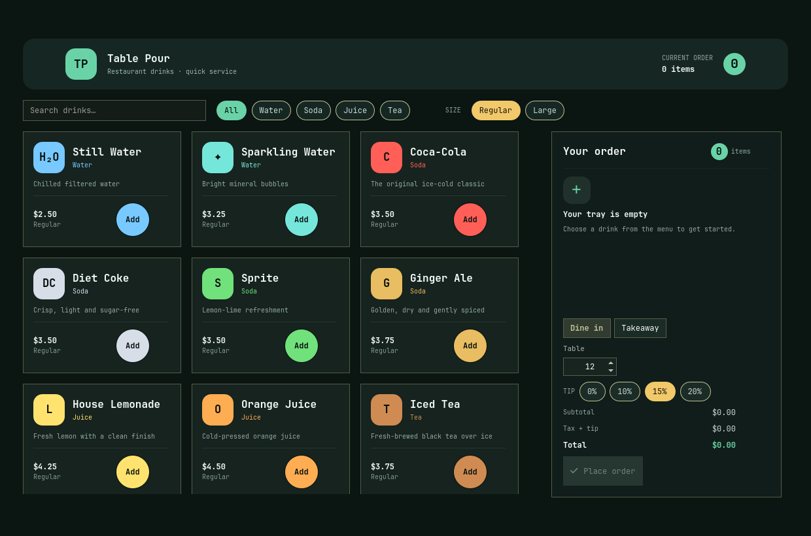

# Nova Pour

A futuristic waiter-friendly restaurant drink ordering application written entirely in the
Zui Ruby DSL. The application owns no QML. Its original beverage hero artwork and nine
photorealistic drink photos are loaded through the framework image component, while live bar
telemetry advances each confirmed order from mixing to ready.



It includes Water, Sparkling Water, Coca-Cola, Diet Coke, Sprite, Ginger Ale, House Lemonade,
Orange Juice, and Iced Tea, with:

- category and text filtering;
- regular and large pricing;
- one-tap cart quantity controls;
- dine-in/table or takeaway service;
- tip, tax, and live totals;
- order confirmation and receipt details.

## Run

From this directory with an installed gem:

```bash
zui run main.rb
```

From the framework checkout:

```bash
../../bin/zui run main.rb
```

Run its interaction tests with:

```bash
ruby -I../../lib test/app_test.rb
```
